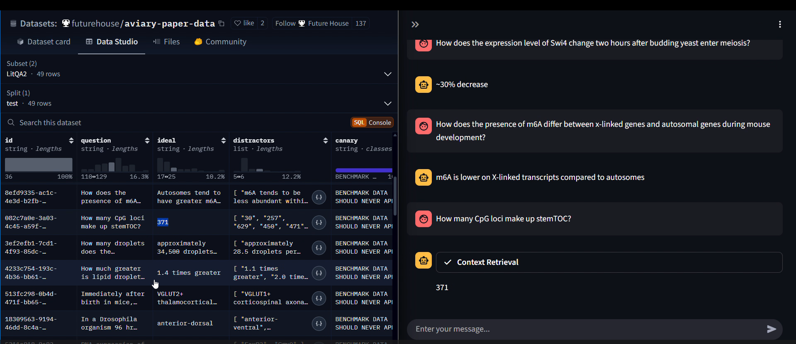
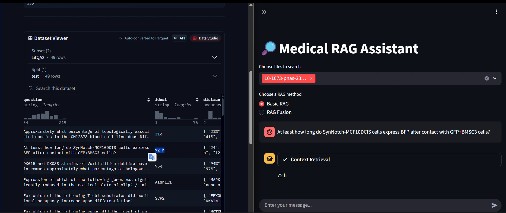
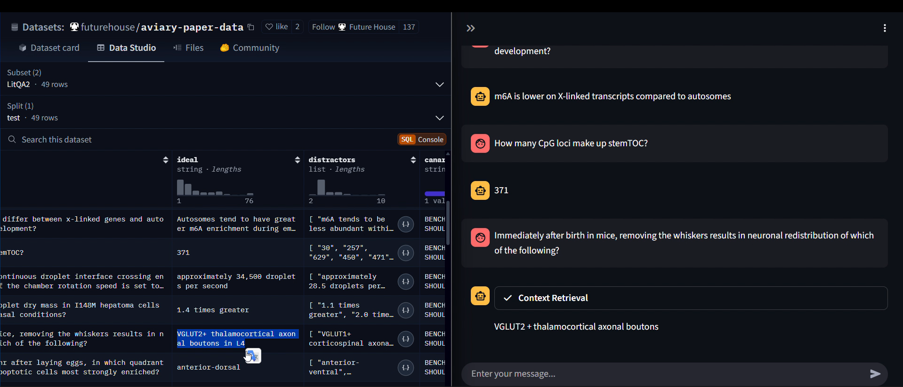

# Medical RAG Assistant — Case Study (Public)

> **Status:** Case-study repo (readme + assets). **Full source is private** to protect IP and dataset licenses. For access, please contact: **\[yi559668@gmail.com]**.

---

## 1) One‑line value

An AI assistant that answers medical questions with **Retrieval‑Augmented Generation (RAG)**, optimized for **exact and ideal answers**  **low‑hallucination** responses.

* **Domain:** Medical (clinical/biomedical literature)
* **Stack:** LangChain • **MedEmbed-large-v0.1** (HF embeddings) • **Cross-Encoder/ms-marco-MiniLM-L12-v2** (reranker) • **FAISS / Qdrant / Milvus** • Python • Streamlit/Flask • **OpenAI GPT‑4.1** (primary) • **Groq Llama‑3‑8B‑8192** (fallback/speed)
* **Dataset for eval:** **LitQA v2** (held‑out **49** unseen questions)

---

# 🎥 2) Demo & Screenshots


* **Short demo video:** [Watch on YouTube](https://youtu.be/2Kx2Rj8KPs8)

---

### Screenshots

  
*Home page of the Streamlit app.*

  
*example1*

  
*example2*

  
*example3*


## 3) Problem & context

LLMs hallucinate—dangerous in medical QA. We specialize a RAG pipeline to the **medical domain**, aiming to reduce hallucination via strong retrieval (hybrid + reranking) and careful context constraints, while improving **retrieval quality, latency, and evaluation fairness**.


---

## 4) Contributions vs. PaperHelper

* **Domain embeddings:** swap generic embeddings for **MedEmbed‑large‑v0.1** (biomedical).
* **Hybrid retrieval:** **dense (FAISS/Milvus/Qdrant) + BM25** rather than vector‑only.
* **Two‑step ranking:** **Reciprocal Rank Fusion (RRF)** → **cross‑encoder/ms‑marco‑MiniLM‑L12‑v2**.
* **Context optimizer:** **top‑3 sentence** compression, **semantic dedup**, tokenizer‑aware truncation.
* **Evaluation:** **LitQA v2** with tolerant scoring for typos/abbreviations; F1/EM/latency/tokens.
* **LLM routing:** **OpenAI GPT‑4.1** for accuracy, **Groq Llama‑3‑8B‑8192** for speed.

---

## 5) System architecture

```
[User UI]
   ↓
[Query preprocessor]
   ↓
[Hybrid retrieval]  <—  [Dense store: FAISS | Qdrant | Milvus] + [BM25]
   ↓                 [Embeddings: MedEmbed‑large‑v0.1]
[RRF fuse] → [Cross‑encoder rerank]
   ↓
[LLM Orchestrator]
   ↙             ↘
[OpenAI GPT‑4.1]  [Groq Llama‑3‑8B‑8192]
   ↓
[Grounded answer + sources panel]
```

**Key choices**

* **Chunking:** recursive character splitting (\~**450** chars, small overlap).
* **Basic RAG retrieval fan‑out:** `k_dense=8`, `k_bm25=32`, final rerank `k=12`.
* **RAG Fusion:** generate **6** sub‑queries; fuse **top‑3**; per‑hit compression **top\_n=3**, **max\_chars=400**; cross‑encoder keep≈**15**; semantic de‑dup to ≈**10** unique chunks.
* **Token safety:** truncate context to fit LLM window (≈**7,500** tokens for Llama‑3‑8B).

---

## 6) Features

* 🔎 Hybrid retrieval + RRF fusion + cross‑encoder rerank
* ✂️ Context compression & semantic dedup → lower tokens, higher precision
* 💬 Model routing (OpenAI ↔ Groq) for accuracy/speed trade‑offs
* 🧪 Fair evaluation harness (F1/EM, latency, token use, typo/subset tolerance)
* 🧯 Medical disclaimer & refusal on insufficient evidence

---

## 7) Dataset & data governance

* **Evaluation:** LitQA v2 (held‑out split).
* **Ingestion:** only licensed/public documents for demos; restricted sets remain private.
* **Privacy:** no PHI/PII stored; logs sanitized.
* **Public repo policy:** this is a **case‑study**—full source kept private.

---

## 8) Evaluation (LitQA v2, 49 held‑out)

### 8.1 Highlights

* **Best Basic RAG (FAISS + OpenAI):** **F1 72.7%**, **EM 63.3%**, **latency 8.98 s**; **fastest** variant **7.33 s** (FAISS + Groq).
* **Best RAG Fusion (FAISS + OpenAI):** **F1 68.1%**, **EM 57.1%**, **latency 12.90 s**.
* **Best Ensemble (Qdrant + OpenAI):** **F1 79.3%**, **EM 69.4%**; **fastest ensemble** **34.47 s** (FAISS + OpenAI).
* **Token efficiency:** **Milvus + OpenAI** used **\~½ tokens** vs FAISS in comparable settings.

### 8.2 Baselines vs. ours

| System                                    |  F1 (%)  |  EM (%)  | Latency (s) |
| ----------------------------------------- | :------: | :------: | :---------: |
| LitQA Baseline — Basic RAG                |   31.5   |   22.4   |     0.90    |
| LitQA Baseline — RAG Fusion               |   23.3   |   16.3   |     3.12    |
| LitQA Baseline — Ensemble                 |   34.7   |   24.5   |     5.97    |
| PaperHelper — RAG (GPT‑4)                 |   53.1   |     —    |     5.70    |
| PaperHelper — RAG Fusion (GPT‑4)          |   58.2   |     —    |     5.60    |
| **Our Best — Basic (FAISS + OpenAI)**     | **72.7** |   63.3   |     8.98    |
| **Our Best — Fusion (FAISS + OpenAI)**    | **68.1** |   57.1   |    12.90    |
| **Our Best — Ensemble (Qdrant + OpenAI)** | **79.3** | **69.4** |    34.56    |

> Summary: A well‑optimized **Basic RAG** beat Fusion on both **accuracy** and **latency** for this task; **Ensemble** gives SOTA F1 but is slower.

### 8.3 What moved the needle (ablations)

* **Hybrid > vector‑only:** BM25 + dense improved recall → higher F1.
* **RRF + cross‑encoder:** better ranking precision than single‑stage retrieval.
* **Compression & dedup:** fewer, cleaner tokens with stable accuracy.
* **Model choice:** OpenAI > Groq on accuracy; Groq wins some speed tests.


## 9) Risks, ethics, and limitations

* **Not a medical device**; educational/research only.
* **No patient advice**; always consult licensed professionals.
* **Limits:** can’t parse figures/tables; Ensemble has high latency; hallucination risk not zero.

---

## 10) Roadmap

* Inline citation markers in UI (optional)
* Live **LLM‑as‑a‑judge** selector for Ensemble
* Hybrid + learning‑to‑rank rerankers
* Multimodal ingestion (figures/tables)
* Distillation for lower latency/cost

---

## 11) Requesting the code

Email **\yi559668@gmail.com** with name, affiliation, intended use. Read‑only review access can be granted on request.

---

## 12) Citation

```
@misc{medical_rag_assistant_2025,
  title  = {Medical RAG Assistant: Domain‑specialized RAG for Medical QA},
  author = {Youssef Ismail Riad},
  year   = {2025},
  url    = {https://github.com/youssef2323/medical-rag-assistant-readme}
}
```

---

## 13) License

Copyright (c) 2025 Youssef Ismail. **All Rights Reserved.**

Commercial use, redistribution, or code access requires written permission.
